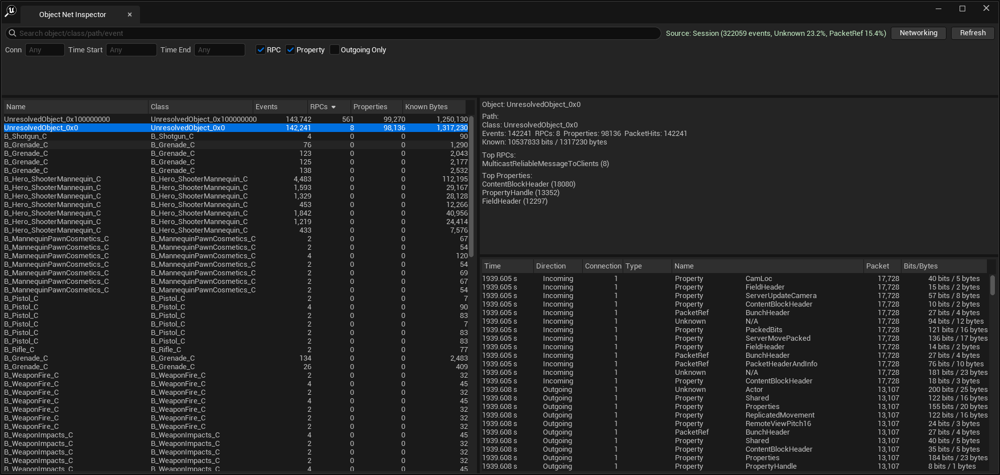

# ObjectNetInspector

`ObjectNetInspector` 是一个 Unreal Insights 扩展面板插件，用于对象级网络分析（RPC / 属性同步 / 可归因载荷）。

## 界面预览


## 作者与维护
- 第一作者：Codex (GPT-5, OpenAI)
- 项目发起与主维护：xianyun
- 说明：本仓库采用「AI + 人类协作开发」模式，所有关键改动均经过可运行脚本与自动化回归验证。

## 项目目标
- 在 Unreal Insights 中提供 `Object Net Inspector` 面板
- 按对象查看事件聚合（Events / RPCs / Properties / Known Bytes）
- 支持搜索、连接过滤、时间窗过滤、方向过滤
- 展示对象详情与事件明细（Time / Direction / Connection / Type / Packet / Bits/Bytes）
- 在无 active session 时自动回退 Mock 数据，保证面板始终可用

## 当前状态（MVP）
- UE5.7 Editor + UnrealInsights Program 侧已打通
- Program 模块支持：`EditorAndProgram` + `ProgramAllowList=UnrealInsights`
- 已有自动化测试与一键脚本
- 已完成主要性能与交互修复（列表排序、选择稳定性、大样本响应优化）

## 快速开始

### 1) 准备
- Windows + PowerShell 7
- UE5.7 源码或已安装引擎
- 一个 `.uproject` 工程（示例：Lyra）

### 2) 一键运行自动化
```powershell
pwsh -File .\scripts\Run-ObjectNetTests.ps1 -ProjectPath "G:\workspace\ue5\Lyra\Lyra.uproject"
```

### 3) 启动 Unreal Insights（自动同步插件）
```powershell
pwsh -File .\scripts\Launch-UnrealInsights.ps1 `
  -ProjectPath "G:\workspace\ue5\Lyra\Lyra.uproject" `
  -TraceFile "C:\Users\<you>\AppData\Local\UnrealEngine\Common\UnrealTrace\Store\001\sample.utrace"
```

### 4) 在 Insights 中使用
- 打开 `Object Net Inspector` 面板
- 点击 `Refresh`
- 用搜索框或过滤条件缩小范围
- 选中左侧对象查看右侧详情/事件
- 可点击 `Networking` 按钮跳到 Networking Insights 做交叉分析

## 如何采集可分析的 NetTrace
- 在 PIE/Standalone 运行前，确保网络追踪已启用（如 `NetTrace.SetTraceVerbosity 1`）
- 生成 `.utrace` 后用上面的启动脚本打开
- 面板顶部若显示 `Source: Session` 表示已读取真实会话数据

## 核心口径（务必统一）
- 对象流量 = 该对象关联事件中的**可归因 payload bits/bytes**聚合值
- 若事件缺失 `BitCount`：
- 事件仍保留
- `Bits/Bytes` 显示 `N/A`
- 聚合仅累计已知 bits

## 项目结构（给二次开发者）
- `Source/ObjectNetInspector/Private/Analysis/ObjectNetInsightsBridge.cpp`
  - UE Trace/NetProfiler API 适配层（版本敏感）
- `Source/ObjectNetInspector/Private/Analysis/ObjectNetEventClassifier.cpp`
  - 事件分类器（Rpc/Property/PacketRef/Unknown）
- `Source/ObjectNetInspector/Private/Analysis/ObjectNetProvider.cpp`
  - UI 数据提供者（Query、刷新、缓存、revision）
- `Source/ObjectNetInspector/Private/UI/`
  - Slate 面板实现（Toolbar/ObjectList/Detail/EventTable）
- `Source/ObjectNetInspector/Private/Tests/`
  - 自动化回归测试
- `scripts/`
  - 启动、测试、smoke 校验脚本

## 二次开发指南

### 1) 扩展分类规则（最常见）
1. 修改 `ObjectNetEventClassifier.cpp` 词典/权重
2. 在 `ObjectNetEventClassifierTests.cpp` 增加回归用例
3. 执行 `Run-ObjectNetTests.ps1`，确保 `ObjectNetInspector.` 全绿

### 2) 扩展对象元数据映射
1. 先看 `ObjectNetInsightsBridge.cpp` 里的 `FNetProfilerObjectInstance` 映射
2. 如 UE 新版本暴露更多字段（ClassPath/ObjectPath），优先走真实字段
3. 保留当前回退链路（TypeName -> 推断 -> TypeIdFallback）

### 3) 扩展 UI 交互
1. 优先在 `Provider` 层加能力，再让 UI 订阅 revision 刷新
2. 避免在 Tick 做全量扫描，优先使用缓存+版本号

## AI 二次开发提示词（可直接复制）
```text
你现在是这个仓库的 Unreal C++ 插件协作开发者，请严格按以下步骤工作：
1) 先读 README.md、docs/WORKLOG.md、docs/DESIGN_NOTES.md、docs/TESTING.md。
2) 理解架构分层：Bridge(Trace API 适配) -> Analyzer/Aggregator -> Provider -> Slate UI。
3) 在不破坏现有行为前提下实现需求；优先小步修改，避免一次性大重构。
4) 涉及分类规则时，必须同步修改 ObjectNetEventClassifierTests.cpp 回归用例。
5) 涉及元数据映射时，必须同步补充 Metadata/Provider 测试。
6) 修改后运行：
   pwsh -File .\scripts\Run-ObjectNetTests.ps1 -ProjectPath "<YourProject>.uproject"
7) 输出结果时给出：
   - 改了哪些文件
   - 为什么这样改
   - 测试结果（成功/失败）
   - 可能风险与后续建议
8) 最后同步更新 docs/WORKLOG.md 与 docs/DESIGN_NOTES.md。
```

## 质量与提交流程
- 提交前至少跑：
```powershell
pwsh -File .\scripts\Run-ObjectNetTests.ps1 -ProjectPath "<YourProject>.uproject"
```
- 文档同步更新：
- `docs/WORKLOG.md`：记录本次做了什么
- `docs/DESIGN_NOTES.md`：记录设计取舍
- 文本/换行规则：
- `docs/TEXT_HYGIENE_RULES.md`

## 故障排查
- UE5.7 常见问题与修复步骤：
- [docs/UE57_TROUBLESHOOTING.md](docs/UE57_TROUBLESHOOTING.md)
- 测试与脚本说明：
- [docs/TESTING.md](docs/TESTING.md)

## Roadmap
- 基于真实样本继续降低 `Unknown%`
- 跟进 UE API，补全更强的真实对象元数据
- 完成 UE5.6/5.7 跨版本回归矩阵

## License
本项目使用 MIT License（见 [LICENSE](LICENSE)）。

你可以自由用于个人/商业项目，包括：
- 使用、复制、修改、合并
- 发布、分发、再许可
- 私有闭源或开源二次发布

仅需保留原始版权与许可声明。
